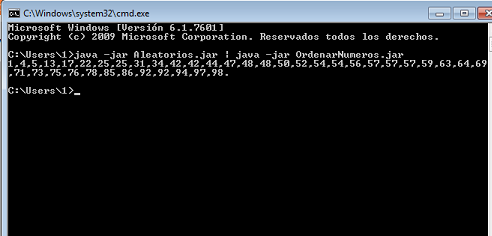
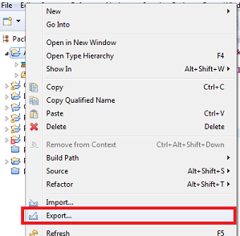
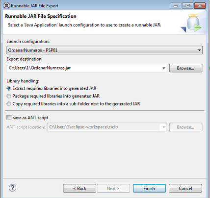
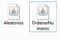
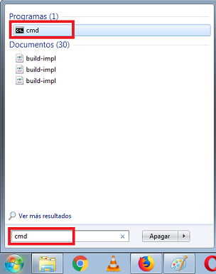

# Ordenar números aleatorios 
Aplicación que genera cuarenta números aleatorios entre 0  y 100 y los ordena. 

## Instalación 

Windows:

```MOVE origen\Aleatorios.jar destino\Aleatorios.jar```  
```MOVE origen\OrdenarNumeros.jar destino OrdenarNumeros.jar```

Linux:

```mv origen/Aleatorios.jar destino/Aleatorios.jar```
```mv origen/OrdenarNumeros.jar destino/OrdenarNumeros.jar```

## Ejemplo de generación de los jar
Haciendo click sobre el main, seleccionar Export - Runnable JAR file - Finish

  
  


## Ejemplo de uso   
Abrir la consola de windows  y ubicarse en donde se ubican  


Redigir la salida de Aleatorios.jar a OrdenarNumeros.jar  


## Configuración de desarrollo
Requiere instalación de Java 8.

## META
Noelia  ue57656@edu.xunta.es
Distributed under the CreativeCommons by-nc license. See https://creativecommons.org/licenses/by-nc/2.0/es/  for more information.
