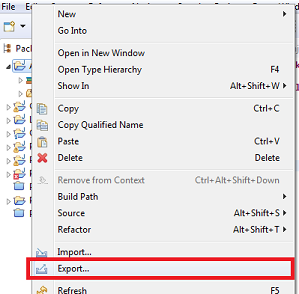
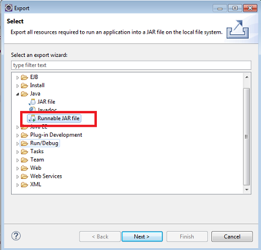
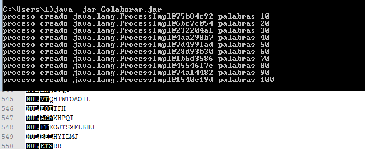

# Generar de forma aleatoria
Aplicación que genera procesos que escriben en el mismo fichero

## Instalación 

Windows:

```MOVE origen\Lenguaje.jar destino\Lenguaje.jar```  
```MOVE origen\Colaborar.jar destino Colaborar.jar```

Linux:

```mv origen/Lenguaje.jar destino/Lenguaje.jar```
```mv origen/Colaborar.jar destino/Colaborar.jar```

## Ejemplo de generación de los jar
Haciendo click sobre el main, seleccionar Export - Runnable JAR file - Finish

  
  


## Ejemplo de uso   
Abrir la consola de windows  y ubicarse en dónde se ubican  


Ejecutar Colaborar.jar y comprobar que se crean 550 líneas 


## Configuración de desarrollo
Requiere instalación de Java 8.

## META
Noelia  ue57656@edu.xunta.es
Distributed under the CreativeCommons by-nc license. See https://creativecommons.org/licenses/by-nc/2.0/es/  for more information.
